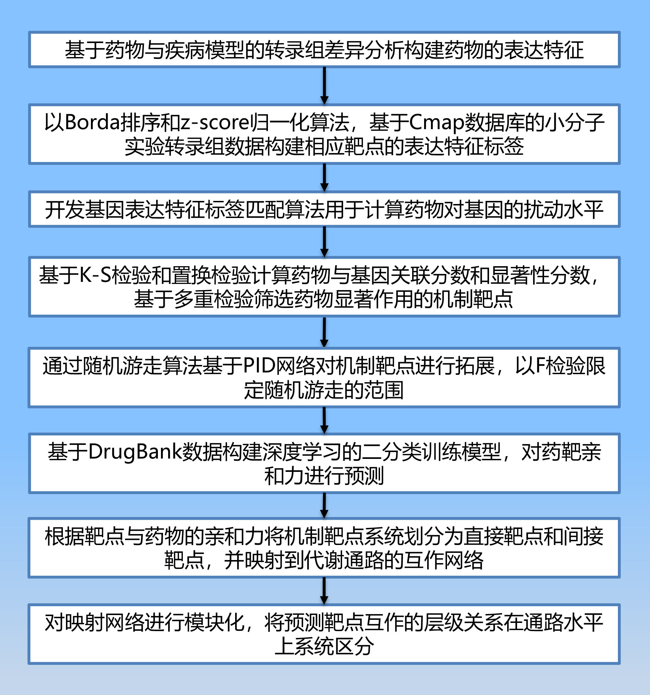

<h4 align="center">

基于药物的转录组数据进行靶标预测的系统化方法

---
- fadf  
## Installation
We recommend to install it locally since Binder needs to be refreshed every time launching. To install locally, we recommend to install from `pip`:
